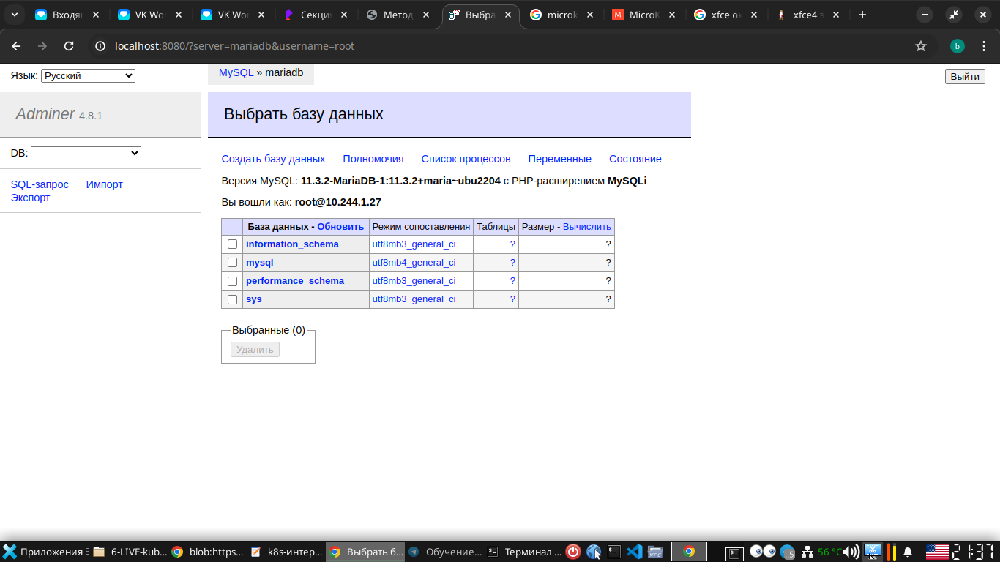
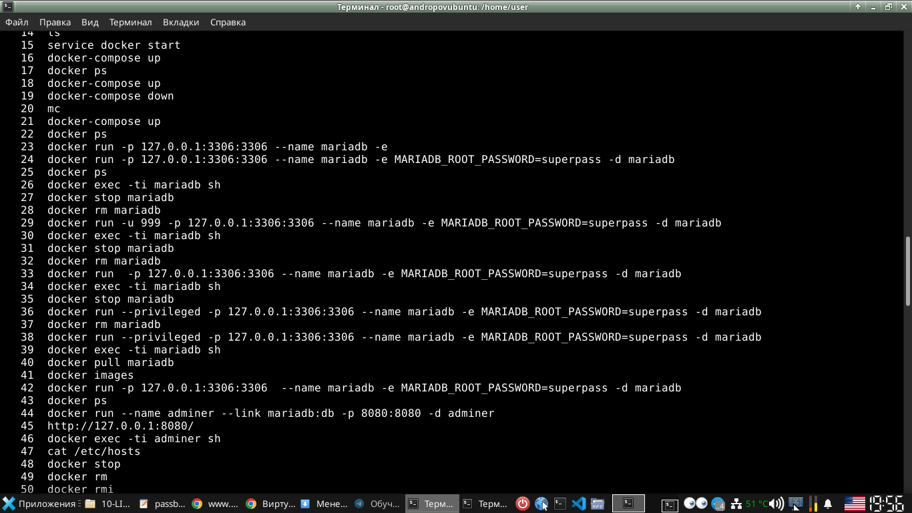
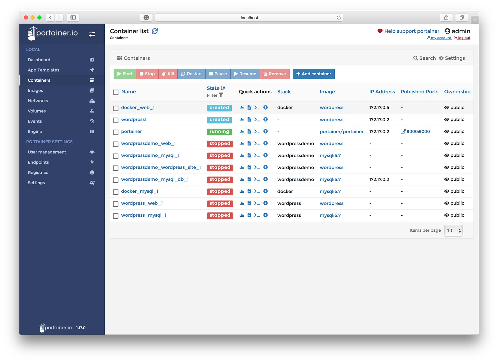
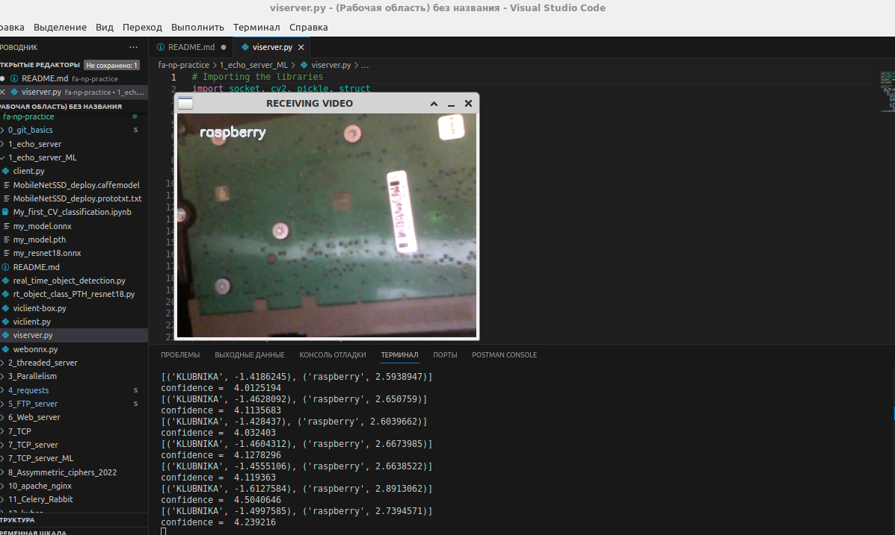
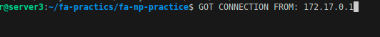
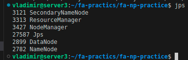
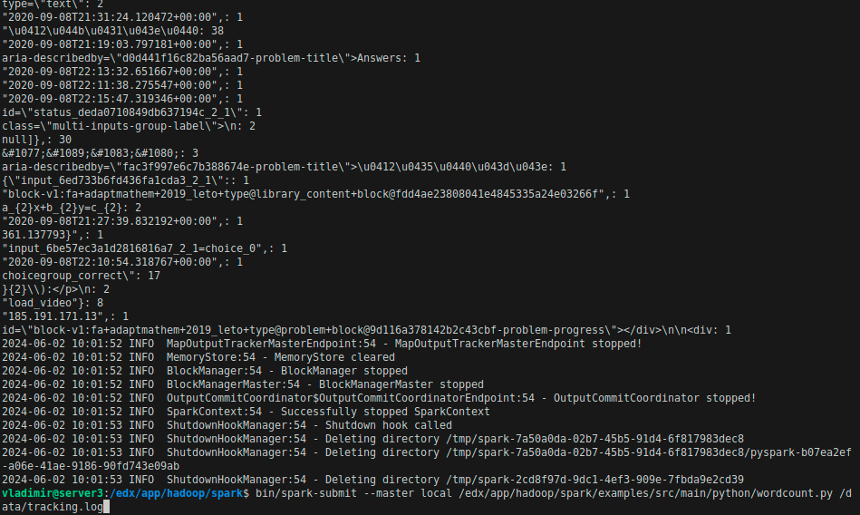
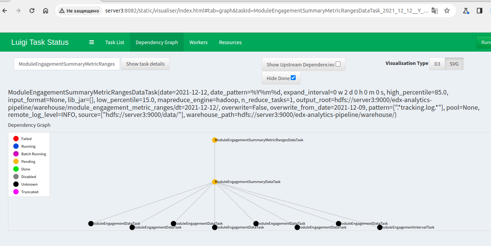

# NP Сетевые системы и приложения - ВТОРОЙ СЕМЕСТР

# Страничка семинаров ПИ22-1 ПИ22-2 ПИ22-3 ПИ22-4

Основные темы практики:
---

Первый семестр:

* ~~[ОСНОВЫ LINUX](https://github.com/VladimirAndropov/fa-os-practice/README.md)~~

Второй семестр:

 * [Сетевые приложения](#брс) 

Материалы курса
---
Вы можете познакомиться с материалами курса - презентациями к лекциям, методических рекомендациям к лабораторным работам на [github](http://koroteev.site/os/).

 Плейлист с видео по данному курсу досупен на [YouTube](https://www.youtube.com/playlist?list=PLhgyvraU60gU8OAhjtcipU_sO7UYvkQl9). 

# План семинарных занятий

- Системы контроля версий
  - Вначале мы изучаем git для совместной разработки
  - Учимся настраивать синхронизацию проектов через GitHub
 
- Использование сокетов
  - Затем создаем простейшее серверное приложение, которое отправляет потоковое видео

- Веб-сервер
  - Развиваем предыдущий опыт в сокетах до создания простейшего http веб-сервера 
  - Добавляем функционал многопоточности для http веб-сервера 
  - Добавляем функционал многопроцессности для ускорения http веб-сервера 
  - Добавляем библиотеки асинхронного программирования для http веб-сервера

Вторая половина семестра
- Развертывание сетевых приложений
  - Пакуем в контейнер - развертываем http асинхронный параллельный веб-сервер на удаленном ресурсе (hub.docker.com)

# БРС

## Первая половина семестра

| Cеминар/Лекция дата  |  № п/п  | Вид учебной деятельности| Максимум  за семестр |
| :---         |     :---:      |      :---:      |          ---: |
|  [Лекция DO1.0](https://youtu.be/HZxQbtYhBYs?si=g7YtSI9QijMIMDlW)   |[ Лабораторная работа-0.1 ](0_git_basics/README.md)  | Работа с Git     | 1    |
| [Лекция DO1.3](https://youtu.be/CE2Ek2dNQLE?si=zRX58WLV3zv-o2Nn)  | [Лабораторная работа-0.2](https://github.com/fa-python-network/0_git_basics)   | сделать форк этого репозитория и открыть его в IDE| -    |
| [Лекция DO1.1](https://youtu.be/TZJKKLTi8b4?si=C3X4B7ikW8B7QjbE)   | Лабораторная работа-0.3   | запушить изменения в проект 1_echo на github     | -    |
|  Домашнее задание DO1.4   | [ Лабораторная работа-0.4](7_TCP_server)   | настроить .gitignore, удалить лишнее| 1    |
| Семинар DO1.0 от 05.02-11.02  | [ Лабораторная работа-0.5 ](7_TCP_server/README.md)  | субмодуль git submodule     | 1    |
|  [Лекция NP1.1](https://youtu.be/UTalhmE_WcI?si=jqIVOyhYmaLaeufX)   |[ Лабораторная работа-1.1](https://github.com/fa-python-network/1_echo_server)   | echo-server     | 1    |
|  [Семинар NP1.1 от 12.02-18.02](https://www.youtube.com/watch?v=ZGk4Kvt7vgg)   |[ Лабораторная работа-1.2 ](1_echo_server/задание2/README.md)   |  echo-client  + telnet/putty   | 1    |
| Домашнее задание NP1.1  | [ Лабораторная работа-1.3](1_echo_server/README.md)   |  live stream video server    | 1    |
|  Семинар NP1.2    |[Лабораторная работа-5.1](5_FTP_server/README.md)  | ftp-сервер (файлы output+file1)     | 1    |
|  Домашнее задание NP1.2   |[ Лабораторная работа-5.2](https://github.com/fa-python-network/5_FTP_server)  | файловый менеджер    | 1    |
| Семинар NP4.4 от 19.02-25.02  | [  Лабораторная работа-4.1](4_requests)  | Postman  (запросы к ruz.fa.ru и к echo-server)   | 1    |
| [Лекция NP4.4](https://youtu.be/mtq-NRC5Wmk?si=5Mq4c4FXd9ridGSg)  | [ Лабораторная работа-4.2](4_requests)   | код http-клиента из Postman   | -    |
| [Лекция NP4.5](https://youtu.be/AWi9_OEOojI?si=PtUD0SV0z0e61_ct) | [ Лабораторная работа-6.1](https://github.com/fa-python-network/6_Web_server)   | Низкоуровневая работа с веб  | 1    |
| [Семинар NP4.5 от 26.02-3.03](https://www.youtube.com/watch?v=WCfEuxd6_P4) [(2дубль)](https://www.youtube.com/watch?v=YTULq4oU3GU)  | [  Лабораторная работа-6.2](6_Web_server/README1.md)  | Веб-сервер HTTP Часть1 (webserver1)  | 1    |
| Домашнее задание NP4.5  | [ Лабораторная работа-6.3](6_Web_server/README2.md)   | Веб-сервер HTTP  Часть2 (фреймворк+вебсервер)  | 1    |
| [Лекция NP2.1](https://youtu.be/_FYcL3tYKec?si=k3cdS1k2qlsWds6E)  | [ Лабораторная работа-2.2 ](https://github.com/fa-python-network/2_threaded_server)  | threaded server    | 1    |
| [Семинар NP2.2](https://www.youtube.com/watch?v=kwB47aGl5IY) | [  Лабораторная работа-3.2](6_Web_server/README3.md)   |  Веб-сервер HTTP  Часть3 (threaded)    | 1    |
| Домашнее задание NP2.1  | [ Лабораторная работа-2.1 ](2_threaded_server/README.md)  | threaded+async web-server    | 1    |
|  [Лекция NP2.2](https://youtu.be/x4MPG22JTtI?si=Nf0eyJpVU-0sitqW)    |[Лабораторная работа-3.1](https://github.com/fa-python-network/3_Parallelism)  | multiprocessing   | 1    |
| [Семинар NP2.1 от 11.03-17.03](https://www.youtube.com/watch?v=g8T14fWkvOw)  | [  Лабораторная работа-7.1](https://github.com/VladimirAndropov/7_TCP_server)  | UDP/TCP-multiprocess-сервер      | 1    |
|  [Лекция DO2.1](https://youtu.be/b9tXQsZPJOE?si=dor0L5v5Sr1lUxiz)   |Лабораторная работа-0.7  | настройка pip   | -    |
| [Лекция DO2.2](https://youtu.be/oKqTB2nJ-Yc?si=T9ACb0-e-6RM-ao9)| Лабораторная работа-0.6  | настройка env   | -    |
| [Лекция NP4.1](https://youtu.be/wdMx35irNKE?si=0jtSv3UgTjmweXLF)   | [Лабораторная работа-10.1 ](10_apache_nginx/README.md)   | apache  |-    |
| [Лекция NP4.1](https://youtu.be/UpS5s4z6odo?si=a4xe8yusvBcZpzGm)  | [Лабораторная работа-10.2 ](10_apache_nginx/README.md)   | nginx  |-    |
|  Семинар 8.1   |[Лабораторная работа-8.1](8_Assymmetric_ciphers_2022/README.md)  |  Lets_encrypt  | 1    |
| Лекция  | [Лабораторная работа-8.2 ](https://github.com/fa-python-network/7_Symmetric_ciphers)   | Основные алгоритмы синхронного шифрования  | -    |
| Домашнее задание 8.1  | [Лабораторная работа-8.3 ](https://github.com/fa-python-network/8_Assymmetric_ciphers)   | Алгоритмы асимметричного шифрования  | 1    |
| Домашнее задание NP2.2   | [Лабораторная работа-3.2 ](https://github.com/fa-python-network/4_asyncio_server) | Асинхронный сервер  | 1    |

## Вторая половина семестра
| Cеминар/Лекция дата  |  № п/п  | Тема и конечный результат | Максимум  за семестр |
| :---         |     :---:      |      :---:      |          ---: |
|   Семинар Celery Workers + Queue    |[Лабораторная работа-11 ](11_Celery_Rabbit/README.md)   | Celery Workers + Queue  |2    |
|Семинар kuber  | [Лабораторная работа-12 ](12_kuber/README.md)   |   |2    |
| [Семинар балансировка nginx](https://youtu.be/ZyGfUllQ34I?si=5ZcWVlZNN-1_qucG)   |[Лабораторная работа-13.1](10_apache_nginx)   |   | 2    |
|  Семинар Portainer+compose  | [Лабораторная работа-13.2 ](13_Dockerfile/README.md)   |   |2    |
|  Семинар Обучаем нейросеть  |[Лабораторная работа-1_ML](1_echo_server_ML)  |    | 2    |
|   [Семинар echo-server_ML в docker](https://youtu.be/vd609d2Wc5E?si=-ejWPgaR3afhioZd)   |[Лабораторная работа-13.3 ](13_Dockerfile/README.md)   |    |2    |
|  Семинар Hadoop   |[Лабораторная работа-14.1](14_Hadoop_pipelines/README.md)  |    | 2    |
|  Семинар Hadoop+Spark   |[Лабораторная работа-14.2](14_Hadoop_pipelines/README.md)  |    | 2    |
|  Семинар Hadoop+Luigi   |[Лабораторная работа-14.3](14_Hadoop_pipelines/README.md)  |    | 2    |
|Контрольная работа ex01 | [Контрольная работа](16_control)  | Решение задач   | 2    |

## Пояснение:
- Доля измеримых видов контроля самостоятельной
работы обучающихся, исключающих субъективное суждение = 30 баллов
- Доля cамостоятельной работы обучающегося = 10 баллов 

Выполнение за половину семестра от 7 до 20 баллов, считается
аттестованным

------------------

# Пример экзаменационного билета Пример ответа и Оценивание
Экзаменационный билет №

1. **Понятие потокобезопасности. Причины, проблематика, способы обеспечения. (20 баллов)**

*Ответ*

*Представьте, что я работодатель, и вы проходите собеседование на должность старшего гребца на галеры. Любая скучная реплика от вас приведёт к отказу брать вас на работу. Душный ответ - 10 баллов.
При ответе рисуете интересную схему с TCP-потоками, стрелочками что-то нужное указываете.(+5 баллов к душному ответу)
 В свободной форме пытаетесь донести необходимость в потокобезопасности, т.к. оно  решает такие-то задачи, и Вы, как специалист в этом, обеспечили решение данной задачи на своей прошлой работе - придумываете историю про свой опыт и правдиво излагаете (+5 баллов). Если я поверил - 20 баллов*

2. **Доступ к общим ресурсам в многопоточной программе. Механизмы блокировки ресурсов модуля threading. (20 баллов)**

*Рисуете потоки многопоточной программы и стрелочками указываете, как происходит взаимодействие с общими ресурсами. Схематично рисуете механизм блокировки и шаг за шагом, что происходит при блокировке ресурсов*

3. **Напишите программу, которая создает четыре нити, исполняющие одну и ту же функцию. Эта функция должна распечатать последовательность текстовых строк, переданных как параметр. Каждая из созданных нитей должна распечатать различные последовательности строк. (20 баллов)**

 *Делаете набросок скрипта на языке программирования Python либо скриптового языка программирования bash, указываете некоторые пояснения алгоритма работы, а также описание всех параметров, которые принимает скрипт (если таковые присутствуют) и описание формата вывода скрипта (если таковой присутствует).  Точно указываете библиотеки, остальные неточности, даже приводящие к полной неработоспособности скрипта допускаются.*